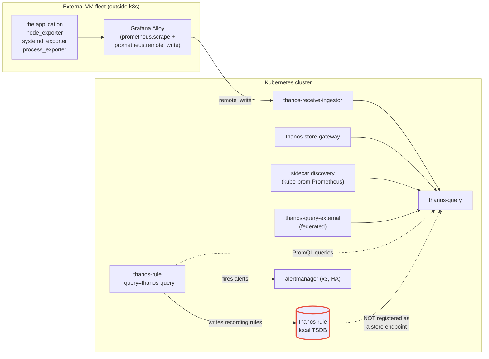

A second story in the "your alert never fired" genre — this time about a perfectly correct alerting expression that silently produced nothing for seven weeks, because the recording rule it depended on wasn't visible to the component that needed to read it. Not in Prometheus. In Thanos.

Generic names throughout: `my-fleet`, `app-foo`, `app-bar`, `cluster="external-fleet"`. The architecture is "a fleet of external VMs running Grafana Alloy → remote-write to Thanos receive inside a Kubernetes cluster, with a separate `thanos-rule` deployment evaluating recording and alerting rules."

## TL;DR

A `record → unless → alert` pattern that catches "the scraper went silent" was deployed to `thanos-rule` and exercised exactly zero times in 30 days, despite the condition occurring repeatedly. The bug:

1. `thanos-rule` writes recording-rule samples **only to its own local TSDB**.
2. `thanos-rule` evaluates rules by querying **`thanos-query`** (via its `--query=…` flag).
3. `thanos-query`'s store endpoints listed every Thanos component **except `thanos-rule-headless`**.
4. Therefore the recording rule's fresh output was invisible to its own consumer until the local TSDB block closed and was uploaded to object storage — a ~2 h staleness window during which the dependent alert can never go pending. After 2 h the data appears via `thanos-store-gateway`, by which point the incident is over and the alert has nothing to fire on.

The fix is one line in the Helm chart values. The lesson is older than the bug: Prometheus's mental model — "recording rules become queryable immediately because Prometheus queries its own TSDB" — does not survive the split into Thanos components.

**Status:** the fix has rolled out, and we verified end-to-end with a synthetic Alloy stop — `InstanceAbsent` transitions `inactive → pending → firing → Slack` in about eleven minutes from a `systemctl stop alloy` on a test host. Details in the [verification section](#verification--what-actually-happened-after-the-fix-rolled-out) below. The test also surfaced a separate design issue — the rule's 30-minute auto-resolve — which gets its own section.

## The setup



<!--
Original ASCII version (kept for reference / for renderers without Mermaid):

+-----------------------------+        +-----------------------------------+
| External VM fleet           |        | Kubernetes cluster                |
| (running outside k8s)       |        |                                   |
|                             |        |   thanos-receive-ingestor (x2)    |
| +------------------------+  |        |          ^                        |
| | the application        |  |        |          | remote_write           |
| | + node_exporter        |  |        |          |                        |
| | + systemd_exporter     |  |        |   thanos-query (x2)               |
| | + process_exporter     |  |        |    --endpoint=receive             |
| | +--------------------+ |  |        |    --endpoint=store-gateway       |
| | | Grafana Alloy      |-----------> |    --endpoint=sidecar-discovery   |
| | | prometheus.scrape  | |  |        |    --endpoint=query-external      |
| | | prometheus.remote_write|  |        |    (...not thanos-rule)         |
| | | loki.write         | |  |        |                                   |
| | +--------------------+ |  |        |   thanos-rule (x1)                |
| +------------------------+  |        |    --query=thanos-query           |
|                             |        |    writes recording rules to      |
+-----------------------------+        |    its own TSDB                   |
                                       |                                   |
                                       |   thanos-store-gateway            |
                                       |   thanos-compact                  |
                                       |   alertmanager (x3, HA)           |
                                       +-----------------------------------+
-->

The red-outlined node is the missing wire: `thanos-rule` writes recording-rule samples to its own local TSDB, but `thanos-query` was never told to read from that TSDB — so fresh samples lived in a gap visible to nobody (including the alert that depended on them) until the next 2 h block closed and was uploaded to object storage.

Deployment is Helm chart `stevehipwell/thanos` v1.23.1 with image `quay.io/thanos/thanos:v0.40.1`. A `kube-prometheus-stack` Prometheus runs alongside with a Thanos sidecar that thanos-query federates as well.

On each external VM, Alloy scrapes localhost metrics endpoints and ships them via `prometheus.remote_write` to a Thanos receive endpoint. A representative shape:


```hcl
prometheus.remote_write "tenant" {
  endpoint {
    url = "https://thanos-receive.example.internal/api/v1/receive"
    basic_auth { username = "..."; password = "..." }
  }
  external_labels = {
    source = "my-fleet",
  }
}

prometheus.relabel "add_static_labels" {
  forward_to = [prometheus.remote_write.tenant.receiver]

  rule { action = "replace"; replacement = "my-fleet";          target_label = "cluster"        }
  rule { action = "replace"; replacement = "production";        target_label = "environment"    }
  rule { action = "replace"; replacement = "host-07";           target_label = "node"           }
  rule { action = "replace"; replacement = "host-07.my-fleet";  target_label = "node_name"      }
}

prometheus.scrape "app_foo" {
  targets         = [{__address__ = "localhost:9100", app = "node-exporter"}]
  forward_to      = [prometheus.relabel.add_static_labels.receiver]
  scrape_interval = "15s"
}

prometheus.scrape "the_application" {
  targets         = [{__address__ = "localhost:9090", app = "app-foo"}]
  forward_to      = [prometheus.relabel.add_static_labels.receiver]
  scrape_interval = "5s"
}
```


Logs ship in parallel via `loki.write` to a Loki instance; this post is about metrics, but the Loki path matters because Slack ultimately receives a mix of log-based and metric-based alerts and the Slack-side symptom of the bug is just "no message arrived."

## The two complementary alerts

For an external host going dark, two failure modes need to be distinguished:

- **"Scraper alive, target broken"** — Alloy is up, but a specific local target isn't responding. Alloy emits `up=0` for that target.
- **"Scraper itself gone"** — Alloy stopped sending altogether (VM rebooted, network partition, Alloy crashed, VM decommissioned). No samples arrive.

The first case is the classic `up == 0` rule. The second case is harder: you can't ask "where is `up == 0`?" because the absent series isn't *anywhere*. You have to remember the target existed and notice it stopped.

That's what these two rules together do:


```yaml
groups:
  - name: fleet-liveness
    rules:
      - record: fleet:target:seen_30m
        expr: |
          max by (node, app, cluster, environment, node_name) (
            max_over_time(up{cluster="external-fleet", app=~"app-foo|app-bar"}[30m])
          )

      - alert: InstanceDown
        expr: up{cluster="external-fleet", app=~"app-foo|app-bar"} == 0
        for: 5m
        labels:
          severity: critical
        annotations:
          summary: "{{ $labels.app }} scrape failing on {{ $labels.node }}"

      - alert: InstanceAbsent
        expr: |
          fleet:target:seen_30m == 1
          unless on (node, app, cluster, environment, node_name)
          up{cluster="external-fleet", app=~"app-foo|app-bar"}
        for: 5m
        labels:
          severity: critical
        annotations:
          summary: "{{ $labels.app }} on {{ $labels.node }} silent"
```


The design has a nice property: a decommissioned VM auto-resolves. The recording rule's `max_over_time(...[30m])` drops a label-set 30 minutes after its last sample, the `unless` clause then matches nothing, and `InstanceAbsent` clears on its own. No rule edit per retirement, no inhibition list to maintain.

## The narrative

We migrated a fleet of external VMs from a legacy parallel monitoring stack (a remote-scraping Prometheus colocated with the VMs) to the new path: Alloy local-scrapes, remote-writes to Thanos, alerts evaluated by `thanos-rule`. The legacy stack continued to run in parallel during the migration, so we had a ground-truth signal: anything the new stack misses, the old one would catch.

One morning an external host went silent for about five hours. The legacy stack fired its `InstanceDown` (it's a remote scraper, so to it the target just stopped responding — `up=0`). The Slack channel for the legacy stack lit up. The Slack channel for the *new* stack stayed quiet for the entire five hours.

Either the rule wasn't deployed, or the rule wasn't routing, or the rule wasn't firing. Time to find out which.

## Diagnostics

A few queries fixed the picture.

**Are the rules loaded?** Yes. `thanos-rule`'s `/api/v1/rules` listed the `fleet-liveness` group with both alerts and the recording rule, `health=ok`, `lastError=""`, `lastEvaluation` recent.

**Did either alert fire historically?**


```promql
count by (alertname) (count_over_time(ALERTS[24h]))
```


returns dozens of `InstanceDown` samples for various hosts today, plenty of unrelated alerts, but `InstanceAbsent`: nothing. Widen to 30 days:


```promql
count_over_time(ALERTS{alertname="InstanceAbsent"}[30d])
```


Empty. The alert has been deployed for ~7 weeks and has never once gone into `pending`, let alone `firing`. Yet the failure mode it's designed for occurs roughly weekly on this fleet.

**Is the logic broken?** Evaluate the alert's expression at a timestamp inside the morning's outage, after enough time has passed that the relevant data has been compacted into object storage:


```promql
fleet:target:seen_30m == 1
unless on (node, app, cluster, environment, node_name)
up{cluster="external-fleet", app=~"app-foo|app-bar"}
```


with `time=<08:40 UTC>`. The result: one series, the absent host. Logic is correct.

**Why didn't it return that at evaluation time?**


```promql
count(fleet:target:seen_30m)        # at "now": 0 series
count(fleet:target:seen_30m)        # at time=14:04 UTC, 2h ago: 28 series
```


The recording rule's *historical* output is fully present. Its *recent* output is not. That points squarely at the data path between thanos-rule and thanos-query.

**Is thanos-rule a store endpoint of thanos-query?**


```
$ curl -s http://thanos-query:9090/api/v1/stores | jq '.data | keys'
[ "query", "receive", "sidecar", "store" ]
```


Sidecar, receive ingestors, store gateway, federated external query — yes. The `thanos-rule-headless` Service exists (it was created when the chart deployed `thanos-rule`, it exposes port 10901/grpc on both pods of the StatefulSet), but it isn't in the list. Crosscheck on the Helm values:


```yaml
additionalEndpoints:
  - dnssrv+_grpc._tcp.prometheus-stack-kube-prom-thanos-discovery.<ns>.svc.cluster.local
  - dnssrv+_grpc._tcp.thanos-store-gateway-headless.<ns>.svc.cluster.local
  - dnssrv+_grpc._tcp.thanos-receive-ingestor-headless.<ns>.svc.cluster.local
  - thanos-query-external.<ns>.svc.cluster.local:10901
  # no thanos-rule-headless
```


Bingo.

## Root cause

Putting it together:

1. `thanos-rule` writes its recording-rule output to its own local TSDB at `--data-dir=/var/thanos/rule`. Block duration is `2h`, retention `48h`.
2. `thanos-rule` does **not** use its local TSDB as the source for rule evaluation. It evaluates every rule by issuing a PromQL query to `thanos-query`, per `--query=dnssrv+_http._tcp.thanos-query.<ns>.svc.cluster.local`.
3. `thanos-query` fans queries out only across the gRPC endpoints listed in `additionalEndpoints`. With `thanos-rule-headless` missing, **`thanos-query` has no path to the recording-rule samples that were written less than ~2 hours ago.**
4. After the 2 h block closes, `thanos-rule` uploads it to object storage; `thanos-store-gateway` indexes it; only then is the data visible to `thanos-query`.

The result: a recording rule whose output is invisible to its own consumer for about two hours. Any alert that depends on that output simply never sees the row, and `unless` collapses to empty, and `for: 5m` waits forever for a sample that never arrives.

The failure mode is unusually quiet:

- `/api/v1/rules` says `health=ok`, no error.
- The alert's `lastEvaluation` is current.
- The expression executed cleanly — it just returned the empty vector.
- The recording rule itself succeeds (its samples exist, just nowhere `thanos-query` can see).
- `count(ALERTS)` shows zero for the alertname, but there's no anomaly metric to graph the *absence* against.

It's the kind of bug you only find because you have an independent monitoring path saying "the thing you expected to alert isn't alerting."

## The fix

One line in the Helm values:


```diff
 additionalEndpoints:
   - dnssrv+_grpc._tcp.prometheus-stack-kube-prom-thanos-discovery.<ns>.svc.cluster.local
   - dnssrv+_grpc._tcp.thanos-store-gateway-headless.<ns>.svc.cluster.local
   - dnssrv+_grpc._tcp.thanos-receive-ingestor-headless.<ns>.svc.cluster.local
+  - dnssrv+_grpc._tcp.thanos-rule-headless.<ns>.svc.cluster.local
   - thanos-query-external.<ns>.svc.cluster.local:10901
```


Deduplication is already wired: `thanos-rule` runs with `--label=rule_replica="$(NAME)"` and `thanos-query` has `--query.replica-label=rule_replica`. So scaling the ruler to more than one replica later doesn't need extra config. Even though we currently run one ruler replica, the labels are already there.

Worth noting: `thanos-rule` also has `--alert.label-drop=rule_replica` so the `rule_replica` label is stripped from outbound alerts to Alertmanager — that part was always correct. The bug was strictly on the query-time visibility of the recording rule's series.

## What else might be affected? (audit checklist)

Before assuming this is one isolated alert, it's worth asking which other alerts in your `thanos-rule` config rely on data the querier can't see. The audit is mechanical:

1. List every recording rule defined in `thanos-rule`:
   
   ```bash
   grep -rn '^[[:space:]]*- record:' thanos-rule/rules/
   ```
   
2. List every alerting expression that references one of those recorded metric names. Recording-rule conventions usually put a colon in the name, so the cheap heuristic is:
   
   ```bash
   grep -rnE 'expr:.*[a-z][a-z0-9_]*:[a-z]' thanos-rule/rules/
   ```
   
   Then filter to the names from step 1.
3. Anything from step 2 that wasn't put in front of you by step 1 is *fine* — it's referencing a recording rule from a different evaluator (e.g. one that ships with the kube-prometheus-stack Prometheus, which queries its own local TSDB and exposes its data to thanos-query via a sidecar).
4. Anything in the intersection is at risk.

For us the intersection was exactly one alert. Other heartbeat-style alerts we've defined recently — pipeline-staleness on a CI-pushed `*_last_success_timestamp_seconds` metric, `absent()` on the same metric, `time() - <metric> > N` patterns on application metrics — all turned out to be fine, because they query metrics that arrive via `thanos-receive` or the sidecar, not via a recording rule emitted by `thanos-rule`.

Concrete design rule that falls out of this: **for any "X has been silent for too long" alert, prefer a metric that the producer pushes directly** (a CI job, an Alloy scrape job, an exporter) **over a recording rule that derives staleness from `max_over_time(up[N])`**. The first uses a path you can verify with a single PromQL query against `thanos-query`. The second has the broken hop in the middle until the Helm values are fixed.

## Verification — what actually happened after the fix rolled out

We picked a non-critical host in the external fleet, ran `systemctl stop alloy`, and watched the lifecycle end-to-end. Times are UTC.

| T+ | Wall | Observation |
|---:|------|------|
| 0 m | 16:02:58 | `systemctl stop alloy` on the test host |
| +5 m | ~16:08 | `up{cluster="external-fleet", node="<that-host>", app="app-foo"}` goes stale on `thanos-query` — the default 5-minute lookback delta has elapsed since the last sample. `InstanceDown` cannot match (no series at value 0). |
| +5 m 48 s | 16:08:46 | `InstanceAbsent` expression becomes non-empty (`fleet:target:seen_30m == 1` minus an empty `up{...}` = 2 series: `app-foo` and `app-bar`). State → `pending`. **This is the part the fix unlocks** — pre-fix it stayed empty here. |
| +10 m 48 s | 16:13:46 | `for: 5m` elapses → state → `firing`. |
| +11 m 16 s | 16:14:14 | Slack message lands in the routed channel: `🔥 InstanceAbsent is CRITICAL on <host> [FIRING:2]`. Round trip from `systemctl stop` to a notification on a phone: about 11 minutes. |

Then we restarted Alloy. Within ~3 minutes `up` was fresh again, `InstanceAbsent` returned to `inactive`, and a resolved-notification followed in Slack. Clean end-to-end.

Then we ran the test a second time on the same host, this time leaving Alloy stopped, to exercise the planned-decommission path: at T+30 m the `max_over_time(up[30m])` window in `fleet:target:seen_30m` no longer contains any samples for the host, the recording rule stops emitting that label set, `unless ...` collapses, and `InstanceAbsent` silently resolves. No human action required.

That second path is the design feature — and also, as it turns out, the design problem worth flagging next.

## The 30-minute auto-resolve trap

We deliberately chose `max_over_time(up[30m])` so a decommissioned host wouldn't keep paging forever. The trade-off is that a *real* outage that exceeds 30 minutes also auto-resolves, while the host is still down. The visible firing window is roughly: pending at T+5, firing at T+10, resolved at T+30 — about **twenty minutes** of total visibility. If on-call misses that window (overnight, in a meeting, in another channel) they look back later, see no firing alert, and conclude the issue has cleared.

The original incident that motivated this whole post was a host silent for about five hours. With the rule as written — even with !1437's fix making it fire at all — that incident would produce a 20-minute Slack burst at T+5–T+30, then nothing for the remaining four-and-change hours. Better than the zero we had pre-fix, but not safe.

Three options worth weighing for the next iteration:

1. **Extend the recording rule's lookback** to a much longer window, e.g. `max_over_time(up[24h])`. Decommissions still auto-resolve, just on a 24-hour horizon — comfortably long for an operator to confirm a retirement and silence the alert manually. Long real outages stay visible.
2. **Add a companion `InstanceAbsentPersistent`** with the long window, routed to PagerDuty rather than Slack, so missing a Slack ping doesn't lose the signal.
3. **Route `InstanceAbsent` itself to PagerDuty in addition to Slack** so the on-call gets paged regardless of which surface they're on.

(1) is the smallest change and the one we're most likely to land first. It does mean a decommissioned host pages for 24 hours before going quiet on its own, but that cost is one-shot per decommission, and an alert that silences itself before anyone notices is the *more* expensive failure mode.

## What we shipped: differential expiry by criticality

We ended up taking option (1) with a refinement. Not every environment in our fleet carries the same operational weight. Some clusters are production — silent self-resolve is unacceptable there. Others are non-production scratch space — silent self-resolve after a day is fine, and probably desirable, because that's also how a planned tear-down works.

So we split the alert in two, scoping by the `environment` label that Alloy already stamps on every series shipped from a host:


```yaml
groups:
  - name: fleet-liveness
    rules:
      # --- Non-production: bounded 24 h firing window ---
      - record: fleet:target:seen_24h
        expr: |
          max by (node, app, cluster, environment, node_name) (
            max_over_time(
              up{cluster="external-fleet",
                 app=~"app-foo|app-bar",
                 environment!~"prod|prod-staging"}[24h]
            )
          )

      - alert: InstanceAbsent
        expr: |
          fleet:target:seen_24h == 1
          unless on (node, app, cluster, environment, node_name)
          up{cluster="external-fleet", app=~"app-foo|app-bar"}
        for: 5m
        labels: { severity: critical }

      # --- Production-tier: effective "never" expiry ---
      - record: fleet:target:seen_30d
        expr: |
          max by (node, app, cluster, environment, node_name) (
            max_over_time(
              up{cluster="external-fleet",
                 app=~"app-foo|app-bar",
                 environment=~"prod|prod-staging"}[30d]
            )
          )

      - alert: InstanceAbsentCritical
        expr: |
          fleet:target:seen_30d == 1
          unless on (node, app, cluster, environment, node_name)
          up{cluster="external-fleet", app=~"app-foo|app-bar"}
        for: 5m
        labels: { severity: critical }
```


Two recording rules, two alerts. Both keep the same `for: 5m` clause and the same `unless` join. The only thing that varies is the `max_over_time` window and which side of the `environment` regex the rule pays attention to.

A 30-day window for production isn't infinite, but it's effectively-never under any realistic outage. The cost — `max_over_time(up[30d])` over a few dozen series — is negligible against compacted blocks served by `thanos-store-gateway`. If anything went wrong here it would be visible in `prometheus_rule_evaluation_duration_seconds` long before it caused operational pain.

### The trap we *thought* we were going to use: `keep_firing_for`

Before settling on two recording rules, we considered Prometheus's `keep_firing_for` attribute (added in 2.42). It seemed like the perfect knob — "keep this alert firing for an extra N time after the expression returns empty" — and reads to a quick scan as a way to *bound* the firing duration.

It is not. Re-read it: *after the expression returns empty.* That means once the recording rule has dropped the host (at +30 m), `keep_firing_for` starts a timer. That timer counts the duration the alert spends in *the kept-firing-after-empty state*. If we set `keep_firing_for: 24h`, the alert stays firing for 24 hours **regardless of whether the host has come back**. The expression returning to non-empty doesn't help: when the host returns, the `unless` join immediately empties the expression, so the alert is still in the kept-firing-after-empty state and the timer doesn't reset to zero, it just keeps counting from whenever it last started.

In other words: with `keep_firing_for: 24h` on a 30 m recording rule, you'd page your on-call for 24 hours on a host that recovered after one. That's exactly the failure mode we'd be trying to avoid.

The clean property — "fires while silent, resolves when the host returns, gives up at N" — only falls out of the **recording rule's `max_over_time` window**. The alerting rule's `keep_firing_for` is for flap-suppression, not for capping how long an alert stays loud.

Worth flagging because the attribute is named in a way that invites exactly this misuse.

## The broader lesson

Recording-rule patterns ported from Prometheus to Thanos look identical and *behave* identically — as long as the data path is wired up. The mental model that holds in Prometheus, "the rule is just a query against my own TSDB, so its output is immediately available to the next rule," depends on a property the all-in-one server has that Thanos's split architecture doesn't automatically reproduce.

In Thanos:

- The ruler writes to its own TSDB.
- The ruler reads from the querier.
- The querier doesn't know about the ruler's TSDB unless you tell it.

Three subsystems that look interchangeable from the outside, with a chained dependency that is enforced by Helm chart configuration values rather than by anything you'd notice while writing the rule. The chart's *defaults* don't wire the ruler in as a store endpoint, presumably because not every deployment runs a ruler at all — but that means every deployment that *does* run a ruler with recording rules is at risk.

Five practical takeaways:

- If you have `thanos-rule` deployed, add `thanos-rule-headless` (or whatever your chart names it) to `thanos-query`'s store endpoints. Today. Before you need it.
- Treat any new `record → unless → alert` pattern with the same suspicion as an alert that has never fired. Trigger the condition once in staging — actually stop a target, actually wait — and confirm the alert reaches the destination. If it doesn't, you haven't built monitoring, you've built a pretty `/api/v1/rules` listing.
- Where possible, write absence/heartbeat alerts against a metric **produced directly by the source** (a CI job pushing a `*_last_success_timestamp_seconds`, an exporter that emits an "I'm alive" gauge) rather than against a recording rule derived from `max_over_time(up[N])`. The first path crosses fewer Thanos components and is much easier to reason about under failure.
- When you use a `max_over_time(up[N])`-style trick to make an absence alert auto-clean a decommissioned host, **think hard about what `N` means for a real outage**. `N = 30m` is short enough to be invisible to a busy on-call; `N = 24h` keeps the alert load-bearing while still letting a planned retirement self-resolve. And not every environment deserves the same `N` — production is cheap to over-alert on, scratch space is cheap to forget about.
- `keep_firing_for` is for flap-suppression, not for capping the firing duration of an absence alert. The cap belongs in the recording rule's lookback window. Naming the attribute clearly will not stop you from misreading it the first time.

The legacy stack we're decommissioning kept running quietly through this episode and saved us from finding the gap during a real outage. Parallel monitoring during a migration is annoying, slow, and the *right* answer, every time.

---

*If you've run into the same gotcha and want to compare notes — or if your `additionalEndpoints` list also looks suspicious — drop me a line.*
