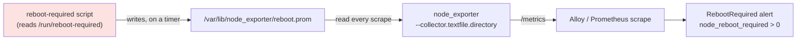




An alert deployed for months, perfectly valid, evaluated on schedule — and structurally incapable of firing, because **nothing in the entire fleet ever produced the metric it watched**.

(`my-fleet` and `app-foo` stand in for the real fleet and workload names.)

## TL;DR

A `RebootRequired` alert shipped in both the on-host Prometheus rules and the central Thanos rules:

```yaml
- alert: RebootRequired
  expr: node_reboot_required > 0
  labels:
    severity: warning
  annotations:
    summary: "Instance {{ $labels.instance }} - reboot required"
    description: "{{ $labels.instance }} requires a reboot."
```

`node_reboot_required` is **not** a built-in node_exporter metric. It only exists if you feed it to node_exporter through the **textfile collector** — a `.prom` file on disk that some external script keeps up to date. The textfile collector directory was configured. The script that writes the file, and the schedule that runs it, were never deployed. So the metric was always absent, `node_reboot_required > 0` matched nothing, and the alert sat `inactive` forever — including across a fleet-wide unattended-upgrades kernel bump that genuinely needed reboots.

The fix looks like three moving parts: a script, a place to drop its output, and something to run it on a timer. Two more problems surfaced during rollout. First, the "obvious" scheduler (cron) wasn't installed on these minimal images. Second — the real lesson — once all three parts *were* deployed, the metric came up `0` everywhere, and stayed `0` on a host that genuinely needed a reboot: the script depended on a binary the images didn't have. The fix that worked was to stop trying to *derive* "is a reboot needed" and read the answer the OS already writes down: `/run/reboot-required`.

## Background: node_exporter's textfile collector

node_exporter exposes hundreds of metrics from the kernel directly. But anything node_exporter *doesn't* know how to collect — package state, "is a reboot pending", backup ages, custom business gauges — you expose through the **textfile collector**.

The mechanism is deliberately dumb, and that's its strength:

1. node_exporter runs with `--collector.textfile.directory=/var/lib/node_exporter`.
2. On every scrape, it reads every `*.prom` file in that directory.
3. It concatenates their contents straight into the `/metrics` exposition.

That's it. There is no daemon, no plugin API, no IPC. Anything that can write a file in the Prometheus text format can publish a metric. The contract is just the exposition format:

```
# HELP node_reboot_required Node reboot is required for software updates.
# TYPE node_reboot_required gauge
node_reboot_required{current_kernel="6.8.0-31-generic",new_kernel="6.8.0-40-generic"} 1
```

The flip side — and the root cause of this whole story — is that node_exporter has **no idea whether a textfile metric is supposed to exist**. If no file writes `node_reboot_required`, the series is simply absent. Absent is not zero. Absent does not error. Absent looks exactly like "everything is fine" to a `> 0` alert. The collector being *enabled* tells you nothing about whether anything is *feeding* it.



The red box is the piece that was missing. Everything downstream of it was already built and waiting.

## The script (first attempt: derive it from the kernel)

There's a vendored collector script that ships with the monitoring role, so the path of least resistance is to deploy it verbatim. Its logic is small and depends only on coreutils plus `file` — it compares the running kernel against the newest kernel image installed under `/boot`:

```bash
#!/usr/bin/env bash

echo '# HELP node_reboot_required Node reboot is required for software updates.'
echo '# TYPE node_reboot_required gauge'

# Parse the version field out of `file /boot/vmlinuz*`
NEXTLINE=0
FIND=""
for I in $(file /boot/vmlinuz*); do
  if [ ${NEXTLINE} -eq 1 ]; then
    FIND="${I}"; NEXTLINE=0
  elif [ "${I}" = "version" ]; then
    NEXTLINE=1
  fi
done

if [ ! "${FIND}" = "" ]; then
  CURRENT_KERNEL=$(uname -r)
  if [ ! "${CURRENT_KERNEL}" = "${FIND}" ]; then
    echo "node_reboot_required{current_kernel=\"${CURRENT_KERNEL}\",new_kernel=\"${FIND}\"} 1"
    exit 0
  fi
fi

echo "node_reboot_required{current_kernel=\"${CURRENT_KERNEL}\"} 0"
```

It always emits a value — `1` when a newer kernel is installed than the one running, `0` otherwise — which is the right instinct (present-and-false beats absent). Note two properties for later: it shells out to **`file`** to identify the kernel image, and it only ever looks at the **kernel**. We deployed it as-is and moved on to the plumbing.

## The Ansible play

Deploying it is two tasks: drop the script, then schedule it. The first task is a plain `copy`:

```yaml
- name: Deploy reboot-required collector script
  ansible.builtin.copy:
    src: "{{ playbook_dir }}/../vendor-collections/.../files/required-reboot.sh"
    dest: /usr/local/bin/node_exporter_reboot_required.sh
    mode: "0755"
  become: true
```

Two details that caused failures during rollout:

**Relative paths resolve from `playbook_dir`, not the repo root.** The playbook lives in `playbooks/`, and the vendored collections are installed one level up in `playbooks/../vendor-collections`. The first attempt used `../../vendor-collections`, which resolves to the *repository root* — a directory that doesn't exist on the CI runner — and every host failed with:

```
Could not find or access '.../playbooks/../../vendor-collections/.../required-reboot.sh'
```

One `../` too many. Easy to miss in review because it *looks* like a path and paths are noise; easy to catch in CI because the check job runs the play against the whole fleet and 17 hosts go red at once.

### Scheduling: the part where cron wasn't there

Pick the cadence deliberately. `node_reboot_required` only changes when a kernel package is *installed* — via unattended-upgrades or a manual `apt` — which happens at most about once a day. And the signal isn't urgent: it means "schedule a reboot sometime," not "act now." A first instinct of "every 5 minutes" is ~288 runs a day to catch a transition that occurs maybe once; **hourly** gives more than enough detection latency at a twelfth of the churn. Match the poll interval to how often the underlying thing can actually change, not to how fast you *could* poll.

The obvious way to run a script on a schedule is cron:

```yaml
- name: Set up cron job for reboot-required collector
  ansible.builtin.cron:
    name: "node_exporter reboot required collector"
    minute: "0"   # hourly; the metric changes at most ~once a day
    job: "/usr/local/bin/node_exporter_reboot_required.sh > /var/lib/node_exporter/reboot.prom"
    user: root
  become: true
```

This failed on almost every host:

```
Failed to find required executable "crontab" in paths:
/usr/local/sbin:/usr/local/bin:/usr/sbin:/usr/bin:/sbin:/bin:/snap/bin
```

`ansible.builtin.cron` is a thin wrapper around the `crontab` binary — it shells out to read and rewrite the user's crontab. On a minimal cloud image there is no cron daemon and no `crontab` binary at all. Exactly one host in the fleet passed: the one where someone had installed cron by hand long ago, for an unrelated `journalctl --vacuum-size` job. That single green host in a sea of red is a good tell that the failure is about *host state*, not about the play.

There are two clean ways out, and the choice is more interesting than it looks.

**Option A — make cron a prerequisite.** Add `cron` to the base package set the fleet installs everywhere, and keep the `cron` task as-is:

```yaml
# in the base "install utilities" task
pkg:
  - ...
  - cron   # provides crontab; required by the reboot-required collector
```

Simple, and it matches the mental model most people already have for "run something periodically". The catch is a subtle one: the validation job runs the play in `--check` mode, and `--check` doesn't actually *install* anything. The `cron` module still needs a real `crontab` binary on the host to introspect the current crontab — even in check mode — so the check stays red until a *real* run has installed the package fleet-wide at least once. It's a one-time chicken-and-egg, not a permanent problem, but it surprises you if you expect the check to flip green the moment the package line lands.

**Option B — skip cron entirely and use a systemd timer.** These are systemd-managed hosts; `systemctl` is always present. A timer needs no extra package, and the validation job goes green immediately because the module's dependency (`systemctl`) already exists everywhere. It's two unit files instead of one cron line:

```yaml
- name: Install reboot-required collector systemd service
  ansible.builtin.copy:
    dest: /etc/systemd/system/node_exporter_reboot_required.service
    mode: "0644"
    content: |
      [Unit]
      Description=Generate node_reboot_required textfile metric for node_exporter
      [Service]
      Type=oneshot
      # Write atomically so node_exporter never reads a half-written file
      ExecStart=/bin/sh -c '/usr/local/bin/node_exporter_reboot_required.sh > /var/lib/node_exporter/reboot.prom.tmp && mv /var/lib/node_exporter/reboot.prom.tmp /var/lib/node_exporter/reboot.prom'
  become: true

- name: Install reboot-required collector systemd timer
  ansible.builtin.copy:
    dest: /etc/systemd/system/node_exporter_reboot_required.timer
    mode: "0644"
    content: |
      [Unit]
      Description=Run node_reboot_required collector hourly
      [Timer]
      OnBootSec=2min
      OnUnitActiveSec=1h
      Persistent=true
      [Install]
      WantedBy=timers.target
  become: true

- name: Enable and start reboot-required collector timer
  ansible.builtin.systemd:
    name: node_exporter_reboot_required.timer
    enabled: true
    state: started
    daemon_reload: true
  become: true
```

The timer version also lets you fix a second, quieter bug for free: the cron one-liner redirects straight into `reboot.prom` with `>`, which truncates the file at the instant the script starts. If node_exporter scrapes in that window it reads an empty or half-written file. The `oneshot` service writes to `reboot.prom.tmp` and `mv`s it into place — and `mv` within one filesystem is atomic, so a scrape sees either the old file or the new file, never a torn one. The same `tmp`-then-`mv` trick is worth doing in cron too; it's just easy to forget there.

Rule of thumb: **on a systemd host, reach for a timer before cron.** Cron earns its place when you need its ecosystem (per-user crontabs, `MAILTO`, operators who think in crontab syntax) or when the platform genuinely isn't systemd. For "run this little script every few minutes on a fleet of cloud VMs", a timer is fewer dependencies and one less daemon to assume exists.

## The metric was produced — and still wrong

Script deployed, scheduled, scraped. The panel showed up, every host reading a calm `0`.

Querying the metric across the fleet, every series came back `0`. Fine on its own. But I happened to check a test host that I *knew* had been waiting on a reboot for weeks, and it too said `0`. Then I noticed what was missing from the labels. The script, when it emits, tags the series with `current_kernel`. In the exposition format an empty label and an absent label look the same, and **Prometheus drops empty labels on ingestion** — so a series carrying `current_kernel=""` arrives with no `current_kernel` label at all. Every series in the fleet was missing it:

```
$ promtool query instant $THANOS 'count by (current_kernel) (node_reboot_required)'
{}  =>  16        # current_kernel ABSENT on all 16 series
```

Absent `current_kernel` means the script reached its final `echo` with `CURRENT_KERNEL` never set — which only happens when `FIND` was empty, which means the `for I in $(file /boot/vmlinuz*)` loop produced nothing. The metric wasn't measuring reboot state at all; it was hardwired to `0` by a parse that silently came up empty on every host.

Onto one of the hosts to see why:

```
$ command -v file
            # nothing — file(1) is not installed
$ cat /var/lib/node_exporter/reboot.prom
node_reboot_required{current_kernel=""} 0
$ ls -l /run/reboot-required
-rw-r--r-- 1 root root 32 Jun  3 ...     # a reboot HAS been required since Jun 3
```

It's the **same root cause as the cron failure**: `file(1)` isn't on these minimal images either. `$(file /boot/vmlinuz*)` expands to nothing, the loop never runs, `FIND` stays empty, and the script falls through to a permanent `0`. The collector was deployed, scheduled, scraped, dashboarded — and reporting an incorrect value. A host that had needed rebooting for *eighteen days* was reported as fine.

I could have just installed `file` (and did, as a one-line stopgap). But step back: the script is doing real work — globbing `/boot`, shelling out to `file`, parsing its English-prose output for the word "version" — to reconstruct a fact the operating system **already computes and writes to a file**. Ubuntu's `unattended-upgrades`/`needrestart` drop `/run/reboot-required` the moment any package — kernel *or* libc, systemd, dbus, … — needs a restart to take effect. The kernel-comparison script can't see those non-kernel cases at all, and it reinvents, badly, something already sitting on disk.

So the real fix throws the parsing away:

```sh
#!/bin/sh
set -eu
OUT="${1:-/var/lib/node_exporter/reboot.prom}"

if [ -f /run/reboot-required ]; then required=1; else required=0; fi

# low-cardinality count; package names deliberately NOT in labels
pkg_count=0
[ -f /run/reboot-required.pkgs ] && \
  pkg_count=$(sort -u /run/reboot-required.pkgs | grep -c . || echo 0)

tmp="$(mktemp "${OUT}.XXXXXX")"; trap 'rm -f "$tmp"' EXIT
{
  echo '# HELP node_reboot_required Whether the node requires a reboot (1) or not (0).'
  echo '# TYPE node_reboot_required gauge'
  echo "node_reboot_required ${required}"
  echo '# HELP node_reboot_required_packages Number of packages that requested the pending reboot.'
  echo '# TYPE node_reboot_required_packages gauge'
  echo "node_reboot_required_packages ${pkg_count}"
} > "$tmp"
chmod 0644 "$tmp"; mv -f "$tmp" "$OUT"; trap - EXIT
```

No `file`, no kernel globbing, no prose parsing. It catches libc/systemd reboots, not just kernel ones. It carries the `tmp`-then-`mv` atomic write inline (so a plain cron `job:` that just invokes it is safe, no shell redirect needed). And on that test host it immediately flips to `1` — the value that had been true, and unreported, for eighteen days.

This is also why it now lives as a repo-owned file rather than the vendored one: the vendored script is managed by `ansible-galaxy` and gets overwritten on the next pull, so editing it in place is a change that quietly evaporates.

## The alert

With the metric finally being produced, the alert that had been dormant for months becomes live without touching it:

```yaml
- alert: RebootRequired
  expr: node_reboot_required > 0
  labels:
    severity: warning
  annotations:
    summary: "Instance {{ $labels.instance }} - reboot required"
    description: "{{ $labels.instance }} requires a reboot."
```

A note on the `> 0` shape. Because the script now always emits `0` when no reboot is pending, the series is present at `0` most of the time and the alert is honestly `inactive`. That's better than the alternative `absent()`-based rule, because `absent()` can't tell you *which* host is missing — it fires once for the whole job — and it conflates "no reboot needed" with "the collector script died". With an always-present gauge you can add a *separate* staleness alert ("`node_reboot_required` hasn't been written in a few hours") that catches the collector itself failing. The metric being absent should alarm you; the metric being `0` should not.

## The dashboard

On the node dashboard it's a one-row addition — a stat panel per instance that reads green at `0` and red at `1`:

- **Query:** `node_reboot_required` (instant), legend `{{instance}}`. Pair it with `node_reboot_required_packages` if you want the count of packages that triggered the pending reboot.
- **Type:** stat / state-timeline. Threshold `0 → green`, `1 → red`.
- **Why a panel and not just an alert:** during a staged kernel rollout you want to *see* the fleet drain from red back to green as hosts reboot, not just get a page and a silence. The state-timeline variant is particularly good here — it shows the reboot-required window as a colored band per host, so "we had 17 hosts pending reboot for six days" is one glance instead of a PromQL archaeology session.

The panel is also the fastest way to confirm the whole pipeline works end to end after deploy: if the stat shows up at all (even at `0`), the script ran, the file was written, node_exporter read it, the scrape landed, and the series exists. A green `0` is the proof of life; you don't have to wait for a real upgrade to know the plumbing is sound.

## Verification

After deploying, the cheapest end-to-end check doesn't require waiting for a real upgrade:

```bash
# on a host
sudo /usr/local/bin/node_exporter_reboot_required.sh
cat /var/lib/node_exporter/reboot.prom
curl -s localhost:9100/metrics | grep node_reboot_required
```

If the last command prints the series, the textfile collector is wired correctly. To force a `1` without actually needing a reboot, just create the flag the OS would: `sudo touch /run/reboot-required` (optionally `printf 'libc6\n' | sudo tee /run/reboot-required.pkgs` to exercise the package count), re-run the script, re-scrape. The series flips to `1`, the panel goes red, and `node_reboot_required > 0` goes `pending → firing` on the next two evaluation cycles. `sudo rm /run/reboot-required*` and re-run to watch it resolve. No kernel surgery, no throwaway host — which is the whole point of reading the OS's own flag instead of re-deriving it.

## Lessons

1. **An enabled collector is not a produced metric, and a produced metric is not a correct metric.** The textfile directory being configured told us nothing — nobody was writing to it. Then the written metric reported `0` from a detector that couldn't detect anything. Verify at each layer: what produces this, and has it ever produced a `1`?
2. **Read the OS's answer instead of re-deriving it.** The script globbed `/boot`, shelled out to `file`, and parsed prose to reconstruct a fact Ubuntu already writes to `/run/reboot-required` — and missed every non-kernel case. When the platform already computes the thing, consume that.
3. **Don't assume a binary is installed.** Both failures here — `crontab` and `file` — were the same shape: a tool assumed present, absent on minimal images. On systemd hosts prefer a timer over cron; otherwise make the package an explicit prerequisite (and remember `--check` won't install it for you).
4. **Write textfile metrics atomically.** `tmp`-then-`mv`, not `>`, so a scrape never catches a half-written file. And make collectors emit an explicit `0` with a separate staleness alert, so a dead collector is loud — an absent series looks healthy to a `> 0` rule, and Prometheus drops empty labels on ingestion (which is the breadcrumb that exposed the broken parse here).

The whole thing is maybe forty lines of YAML and a ten-line shell script. "Deployed, evaluating, and green" can still mean incapable of reporting the actual state — here on two separate levels: an alert whose metric nothing produced, and then a metric whose detector couldn't detect. Both presented as the same silence.

